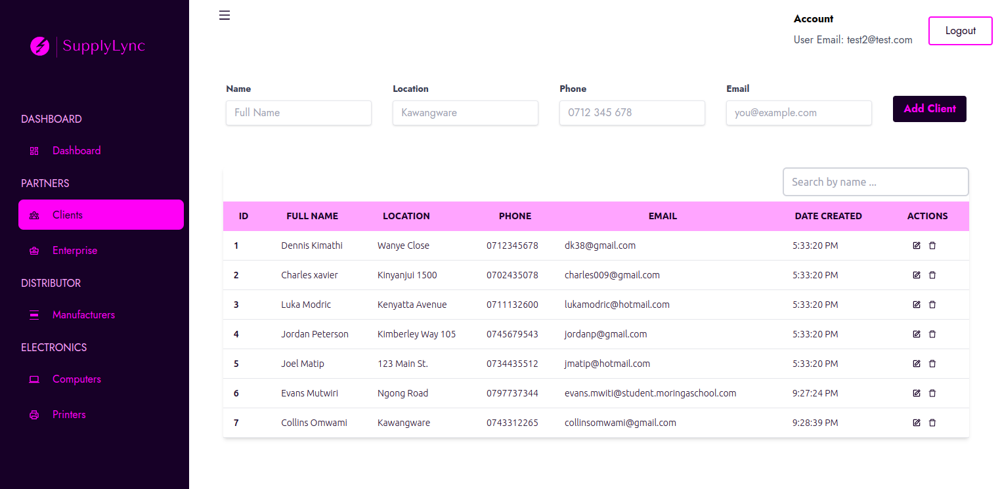

# SupplyLync

An inventory tracking application for an electronics supplier that leases computers and printers to clients including businesses.

## Screenshot
 

## Table of contents

- [Overview](#overview)
  - [User Stories](#user-stories)
- [My process](#my-process)
  - [Built with](#built-with)
  - [What I learned](#what-i-learned)
  - [Continued development](#continued-development)
  - [License](#license)
- [Author](#author)

## Overview
In order to get started, sign up with a dummy email address and password then login with the credentials.

### User Stories

Users should be able to:

- View the individual clients in contact with the business.
- View the business enterprise in contact with the business.
- See the electronics from different manufacturers that the clients and the enterprises have leased including the lease terms. 
- The supplier can create a new cliet, business and electronics.

## My process
- Started by designing low fidelity wwireframe of the application based on the user stories.

Figma Design -[supplylync-Application](https://www.figma.com/file/eC6vJepMrRhNeKD6JD3kdZ/LeapTop)

- Modelled the database using active record. The application uses a one to one association between client and computer as well as a many to many association between enterprises and printers.

- Built API routes using sinatra.

- Consumed the API's using axios.

- Built the frontend with react.

- Deployed the database to Heroku.

- Deployed the frontend with vercel.

### Built with

- React for Frontend Development
- TailwindCSS
- Ruby
- Active Records for Database Modelling
- Sinatra to build API's

### What I learned

- Understood the typical file structure for a Sinatra application
- Use the Rerun gem to help speed up development.
- Learn deploying a database on Heroku using Heroku stack:20

### Continued development

Future developments will be built using Rails so as to support different users.
Intergrate payments.

## License
MIT License
Copyright (c) [2022] [License](LICENSE.txt)
Permission is hereby granted, free of charge, to any person obtaining a copy
of this software and associated documentation files (the "Software"), to deal
in the Software without restriction, including without limitation the rights
to use, copy, modify, merge, publish, distribute, sublicense, and/or sell
copies of the Software, and to permit persons to whom the Software is
furnished to do so, subject to the following conditions:
The above copyright notice and this permission notice shall be included in all
copies or substantial portions of the Software.
THE SOFTWARE IS PROVIDED "AS IS", WITHOUT WARRANTY OF ANY KIND, EXPRESS OR
IMPLIED, INCLUDING BUT NOT LIMITED TO THE WARRANTIES OF MERCHANTABILITY,
FITNESS FOR A PARTICULAR PURPOSE AND NONINFRINGEMENT. IN NO EVENT SHALL THE
AUTHORS OR COPYRIGHT HOLDERS BE LIABLE FOR ANY CLAIM, DAMAGES OR OTHER
LIABILITY, WHETHER IN AN ACTION OF CONTRACT, TORT OR OTHERWISE, ARISING FROM,
OUT OF OR IN CONNECTION WITH THE SOFTWARE OR THE USE OR OTHER DEALINGS IN THE
SOFTWARE.

## Author

- Website - [Dennis Kimathi](https://www.your-site.com)
- Linkedin - [Dennis Kimathi](https://www.linkedin.com/in/dennis-kimathi-46326711b/)
- Twitter - [@mbiebuz](https://twitter.com/mbiebuz)

